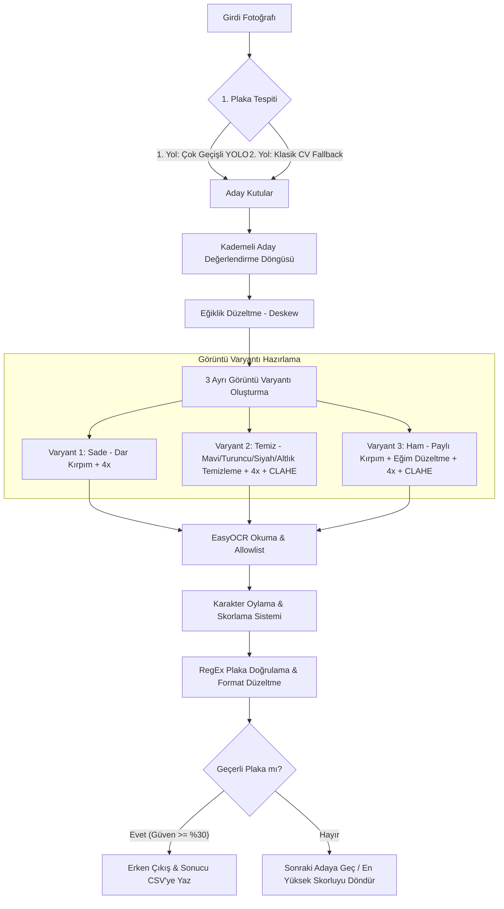

# Türk Plaka Tespit ve Temizleme Pipeline Raporu

Bu belgede, [colab_local.py](file:///c:/Users/Yavuz%20Altay/Desktop/%C4%B0yex/PlateDetection/colab_local.py) dosyasında uygulanan **Türk Plaka Tespit, Temizleme, İyileştirme ve OCR Okuma** akışının mimarisi, uygulanan yöntemler, tercih edilen algoritmalar ve bunların teknik gerekçeleri detaylı olarak açıklanmıştır.

---

## 🗺️ Genel Pipeline Akışı (Pipeline Architecture)

Pipeline, girdi olarak verilen araç fotoğraflarından plaka numarasını yüksek doğrulukla çıkarabilmek için **10 ana aşamadan** oluşur. 

Aşağıdaki şemada uçtan uca akış özetlenmiştir:

---

## 🛠️ Detaylı Aşama Analizi ve Yöntemlerin Tercih Nedenleri

### 1. Plaka Bounding Box Tespiti (Çok Geçişli & Yedekli Sistem)
*   **Kademeli YOLO (`detect_plate_boxes`):** Görüntü çözünürlüğü ve plaka boyutları değişkenlik gösterir. YOLO modeli tek bir çözünürlükte (`imgsz=640`) küçük plakaları kaçırabildiği için kod, **farklı ölçeklerde (640, 960, 1280)** ve **farklı güven eşiklerinde (0.25, 0.40)** çok geçişli arama yapar.
*   **Klasik CV Yedekleme (`detect_plate_classical`):** YOLO modelinin tamamen başarısız olduğu (örneğin kötü ışık veya sıra dışı plaka açıları) durumlar için **Blackhat Morfolojisi** ve **Sobel kenar tespiti** tabanlı klasik bir bilgisayarlı görü dedektörü yedek olarak çalışır.
*   **Aday Yönetimi:** Tespit edilen ilk kutu her zaman en doğru plaka olmayabilir. Kod, en yüksek güvenilirliğe sahip ilk 3 aday bölgeyi (`valid_boxes[:3]`) ayrı ayrı analiz eder.

---

### 2. Eğiklik Düzeltme (Skew Correction / Deskew)
*   **Yöntem:** Plaka gövdesi OTSU eşikleme ile maskelenir ve en büyük konturun minimum alanlı döndürülmüş dikdörtgeni (`cv2.minAreaRect`) bulunarak eğim açısı hesaplanır.
*   **Döndürme:** Açı $1^\circ$ ile $30^\circ$ arasındaysa, görüntü merkezinden ters yönde döndürülür (`cv2.warpAffine` ve `cv2.INTER_CUBIC`). Döndürme sonucu oluşan boşluklar `BORDER_REPLICATE` ile kenar piksellerinden doldurulur; böylece yapay siyah üçgenlerin OCR'ı yanıltması engellenir.
*   **Neden?** Araç fotoğrafları genellikle açılı çekilir. Eğik karakterler OCR motoru tarafından (örneğin `1` ve `/`, `0` ve `D`) sıklıkla yanlış okunur. Döndürme düzeltmesi doğruluğu ciddi oranda artırır.

---

### 3. Kirleticilerin Temizlenmesi (Morfolojik Analiz & Inpainting)

Plaka üzerinde harf dışındaki unsurlar (mavi şerit, sticker, reklamlar) OCR başarısını düşürür. Kodda bu unsurları temizlemek için ileri seviye yöntemler uygulanır:

#### A. Mavi TR Bandı Boyama (`detect_blue_band`)
*   **Yöntem:** Plakanın sadece sol %25'lik kısmında (false positive'i engellemek için) **HSV renk uzayında** mavi aralığı ($H: 100\text{-}130$, $S: 80\text{-}255$, $V: 50\text{-}255$) taranır. Mavi pikseller bulunduktan sonra maske 3x3 kernel ile genişletilir ve `cv2.inpaint` (TELEA algoritması) ile **beyaza boyanır**.
*   **Neden Kırpma Yerine Boyama?** Eski yöntemde mavi bant doğrudan kesiliyordu. Ancak plakanın ilk rakamları (il kodu olan `34`, `06` vb.) mavi banda çok yakın olduğunda kırpma işlemi bu rakamları da yok ediyordu. Boyama yöntemiyle rakamlar korunurken arka plan temizlenmiş olur.

#### B. Turuncu Muayene Sticker'ı Temizleme (`detect_and_remove_orange_sticker`)
*   **Yöntem:** HSV uzayında turuncu pikseller ($H: 5\text{-}25$, $S: 100\text{-}255$, $V: 100\text{-}255$) taranır. Toplam plaka alanının %0.5'inden fazla turuncu piksel varsa sticker var kabul edilir. Maske 5x5 kernel ile 2 iterasyon genişletilerek `cv2.inpaint` ile doldurulur.
*   **Neden Koşullu?** Sticker olmayan plakalarda inpaint algoritması boş yere çalıştırılırsa beyaz yüzeyde bulanıklık ve gürültü oluşturarak okumayı bozabiliyordu. Bu yüzden önce varlığı doğrulanır, sonra temizlenir.

#### C. Siyah Yapıştırma / Sticker Temizleme (`detect_and_remove_black_sticker`)
*   **Yöntem:** Karakterler de siyah olduğu için ayrım hassastır. OTSU binarizasyon sonrası bulunan siyah konturlar şu filtrelere sokulur:
    1.  **Aspect Ratio:** Plaka karakterleri dikey dikdörtgendir (en/boy oranı $\approx 0.3\text{-}0.9$). Siyah sticker'lar ise genelde yuvarlak veya karedir (oran $\approx 1.0$).
    2.  **Konum:** Sticker'lar genellikle plaka kenarlarına veya köşelerine yapıştırılır.
    3.  **Dairesellik (Circularity):** Konturun daireselliği ölçülerek yuvarlak sticker ayrımı yapılır.
*   Harf yapısına uymayan bu bölgeler maskelenerek inpaint ile temizlenir.

#### D. Plaka Çerçevesi ve Altlık (Reklam) Temizleme (`remove_plate_frame_and_holder`)
*   **Adım 1 (Çerçeve):** Gaussian Blur + Canny kenar tespiti + `approxPolyDP` poligon yaklaştırması ile en büyük dikdörtgen bulunarak plaka çerçevesinin içi kırpılır. Böylece siyah plaka çerçevesi elenir.
*   **Adım 2 (Altlık):** Plakanın alt %25'lik kısmındaki küçük konturlar incelenir. Plaka karakterlerinden çok daha küçük olan tüm yazılar (galeri isimleri, telefonlar) beyaza boyanır.

---

### 4. Görüntü İyileştirme ve Süper Çözünürlük (Enhancement)
*   **4x Büyütme (Bicubic Interpolation):** Plaka görüntüleri küçük olduğunda pikselleşme nedeniyle karakterler birleşir. Görüntü çift kübik interpolasyon ile hedef yüksekliğe (~270px) büyütülür.
*   **CLAHE (Contrast Limited Adaptive Histogram Equalization):** Standart histogram eşitleme görüntünün genelinde aşırı parlamaya yol açar. CLAHE, görüntüyü küçük karolara (tile) bölerek yerel kontrastı artırır ve gürültü sınırlandırması sayesinde harf sınırlarını netleştirir.
*   **Adaptif Binarizasyon (`adaptive_binarize`):** Işık gölge dağılımının dengesiz olduğu durumlarda, yerel piksellerin ağırlıklı ortalamasına göre ikili (siyah-beyaz) maske oluşturulur.

---

### 5. Çoklu Strateji OCR ve Karakter Oylaması (`read_plate_ocr`)
Tek bir temizleme yöntemi her plaka için kusursuz çalışmayabilir. Bu yüzden kod **üç farklı görüntü varyantını** paralel olarak işler ve OCR sonuçlarını yarıştırır:

1.  **"Sade" Varyant:** Pay bırakmadan dar kırpılmış ve 4x büyütülmüş ham plaka. Çerçeve dışındaki gölgelerin içeri girmesini engeller.
2.  **"Temiz" Varyant:** Tüm mavi şerit, turuncu/siyah sticker ve altlık temizliği yapılmış, CLAHE uygulanmış hali. Kirli/sticker'lı plakalarda en iyi sonucu verir.
3.  **"Ham" Varyant:** Eğim düzeltmesi yapılmış ancak morfolojik temizlik uygulanmamış hali. Temizlik algoritmalarının yanlışlıkla harflere zarar vermesi ihtimaline karşı sigortadır.

#### Karakter Bazlı Oylama (Character Voting)
Farklı varyantlardan gelen okuma sonuçları (`34ABC12`, `34A8C12`, `34ABC12`) harf harf oylamaya sokulur. Her pozisyondaki en yüksek oy alan karakter seçilerek nihai plaka metni sentezlenir. Bu sayede hata payı minimuma indirilir.

---

### 6. Türk Plaka Formatı Doğrulama ve Düzeltme (Formatting & RegEx)
Plaka metni okunduktan sonra Türk plaka standartlarına göre yapısal olarak düzeltilir (`format_turkish_plate_ex`):
*   **Sık Yapılan Hataların Giderilmesi:**
    *   Sayısal olması gereken yerlerdeki karakterler sayıya çevrilir (Örn: `O`, `D`, `B` $\rightarrow$ `0`, `I` $\rightarrow$ `1`, `S` $\rightarrow$ `5`).
    *   Harf olması gereken yerlerdeki rakamlar harfe çevrilir (Örn: `0` $\rightarrow$ `O`, `1` $\rightarrow$ `I`, `8` $\rightarrow$ `B`, `5` $\rightarrow$ `S`).
*   **RegEx Şablonları:** Türk plaka formatlarına uygunluk denetlenir:
    1.  `99 X 9999` (İl kodu + 1 harf + 4 rakam)
    2.  `99 XX 999` veya `99 XX 9999` (İl kodu + 2 harf + 3/4 rakam)
    3.  `99 XXX 99` veya `99 XXX 999` (İl kodu + 3 harf + 2/3 rakam)

---

## 📊 CSV Loglama Yapısı

İşlemler tamamlandıktan sonra sonuçlar `plaka_log.csv` dosyasına Excel uyumlu (`utf-8-sig`) biçimde kaydedilir. Sütun yapısı aşağıdaki gibidir:

| Plaka | Tarih_Saat | Guven% |
| :--- | :--- | :--- |
| 34 EVC 531 | 2026-07-07 17:15:32 | 92.4 |
| 06 ANK 06 | 2026-07-07 17:16:10 | 88.7 |

Eğer bir plaka tespiti yapılamadıysa, dosyanın temiz kalması ve istatistikleri bozmaması için CSV dosyasına satır olarak eklenmez (atlanır).
