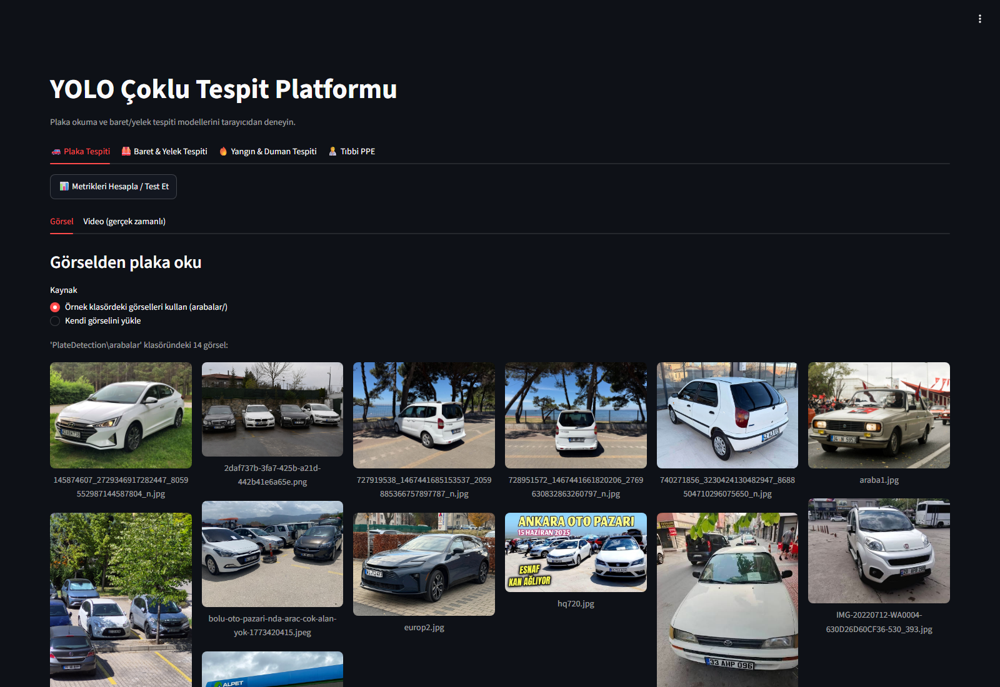
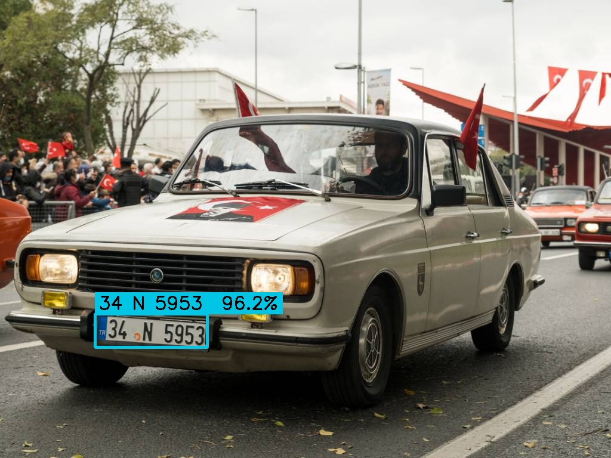
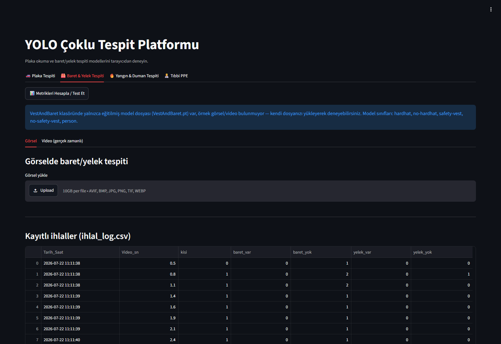
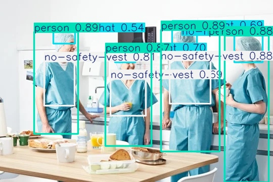
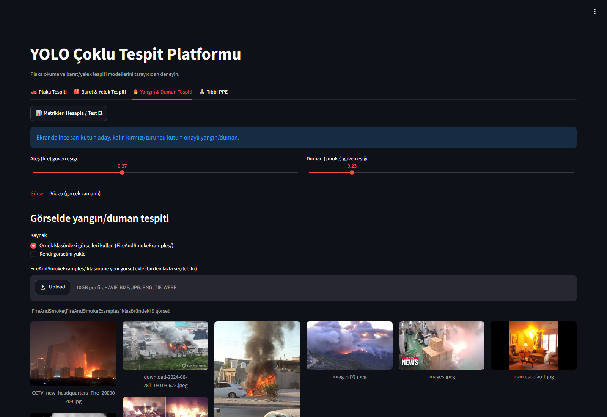
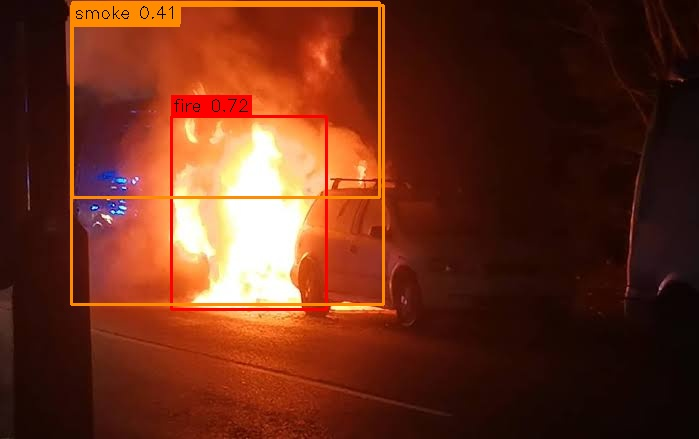
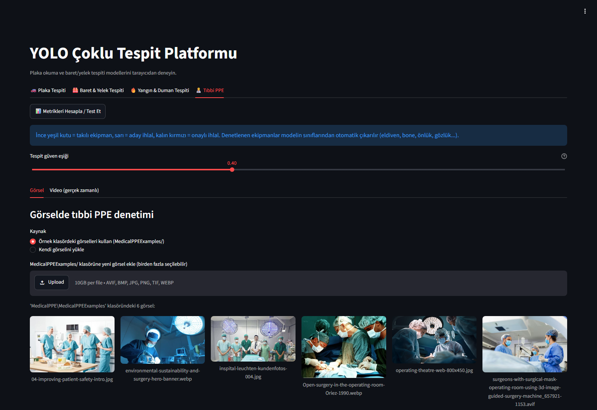
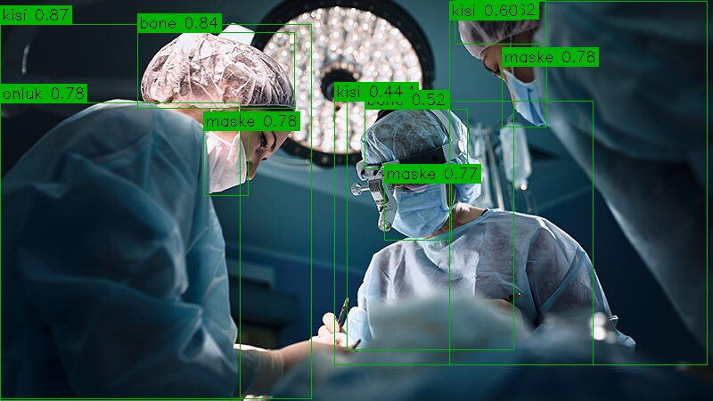

# YOLO Plate · Helmet-Vest · Fire-Smoke · Medical-PPE Detection

[](https://www.python.org/)
[](https://docs.ultralytics.com/)
[](https://streamlit.io/)
[](LICENSE)

A real-time detection and monitoring platform built during an internship, combining **4 independent YOLO-based vision modules in a single Streamlit interface**: **license plate recognition (OCR)**, **hardhat & safety-vest inspection**, **fire & smoke monitoring**, and **medical PPE compliance checking**.

Every module works with photos, video files, and a live phone camera (IP Webcam); detections are written to CSV and archived with evidence snapshots. The **"Compute Metrics"** button in the UI measures each model's accuracy live on its test set — no hardcoded numbers.



## In action — real screenshots

Everything below was captured while the system was running: first the actual application UI, then each model's annotated output on a real sample.

### License plate detection + OCR

| Interface (sample gallery) | Model output (`araba1.jpg` → **34 N 5953**, 96.2%) |
|---|---|
|  |  |

The production pipeline scans each frame at 3 scales, merges boxes, corrects skew, cleans the blue TR band / orange stickers, and votes across 5 image variants in OCR.

### Hardhat & Safety Vest

| Interface (with violation log) | Model output (person + `no-safety-vest` detections) |
|---|---|
|  |  |

### Fire & Smoke

| Interface (per-class thresholds) | Model output (`fire` 0.72 + `smoke` 0.41) |
|---|---|
|  |  |

On video these detections alone never raise an alarm — events are confirmed through YOLO tracking + N-of-M temporal voting (fire 4/8, smoke 5/10) and recorded with evidence snapshots.

### Medical PPE

| Interface (sample gallery) | Model output (`person`, `surgical-cap`, `mask`, `gown` — no violation) |
|---|---|
|  |  |

## Why this is a solid project

- **Measurement culture:** Thresholds are calibrated from the peaks of F1-Confidence curves, not gut feeling. Plate and medical-PPE metrics are measured by running the **actual production pipeline**, not plain `model.val()`.
- **Temporal reasoning:** On video, YOLO tracking + N-of-M confirmation means single-frame glints never become alarms; decisions are made on accumulated evidence.
- **Rejected-by-measurement ideas:** A P2 detection head, 3×3 tiling, and full-frame upscaling were all tried and rolled back when the test set showed no benefit — reports under `docs/`.
- **14,375-image training set** assembled from multiple sources; weak classes got 10–15× more data with zero test-set leakage.

## Modules and measured results

| Module | Folder | What it does | Test result |
|---|---|---|---|
| Plate Detection + OCR | `PlateDetection/` | Multi-pass YOLO detection, CLAHE + EasyOCR reading, Turkish plate validation, track + character voting on video | P 91.7% · R 85.7% · **mAP50 86.1%** (real pipeline, 391 images) |
| Hardhat & Vest | `VestAndBaret/` | hardhat / no-hardhat / safety-vest / no-safety-vest / person — workplace safety violations | P 92.6% · R 91.0 · **mAP50 94.6%** (train-val) |
| Fire & Smoke | `FireAndSmoke/` | Track + N-of-M temporal confirmation (fire 4/8, smoke 5/10), evidence photo + CSV | P 72.8% · R 53.0% · **mAP50 61.1%** (351 images) |
| Medical PPE | `MedicalPPE/` | 14-class PPE inspection, TTA + 2×2 tiled detection, person-equipment matching | P 76.3% · R 80.3% · **mAP50 80.0%** (535 images) |

## Architecture — 4 independent modules, one interface

No module imports another; each also runs standalone from the command line. Shared video/live layers: YOLO track (persistent IDs) → per-class confidence threshold (calibrated from F1 peaks) → N-of-M temporal filter → evidence recording on confirmation (photo + CSV, no alarms). TTA is always on for photos.

## Quick start

```bash
# Windows — one click:
scripts\run-windows.bat

# Linux / macOS:
bash scripts/run.sh
```

Full setup (venv, GPU/CPU dependencies, completing the missing model files): **[docs/kurulum.md](docs/kurulum.md)** (Turkish).

> Note: Large model files (`.pt`) are not in the repo (see `.gitignore`). `docs/kurulum.md` §4 says which file goes where.

## Project structure

```
app.py                  → 4-tab Streamlit interface (single entry point)
requirements.txt        → all dependencies, installed into one venv
PlateDetection/         → plate detection + OCR (photo and video pipelines)
VestAndBaret/           → hardhat & vest model and violation log
FireAndSmoke/           → fire/smoke monitor, training and evaluation scripts
MedicalPPE/             → medical PPE monitor, dataset merging, training scripts
scripts/                → Windows (.bat) and Linux/macOS (.sh) launchers
docs/
  kurulum.md            → setup guide for another machine (Turkish)
  proje-raporu.md       → full technical narrative (Turkish)
  plaka-video-mantigi.md→ video plate tracking, step by step (Turkish)
  plaka-pipeline.md     → plate photo pipeline details (Turkish)
  screenshots/          → interface captures + real system outputs
```

Each module keeps its own technical report in its folder (`TEKNIK_RAPOR.md` / `README.md`, Turkish).

## Shared pipeline (video/live monitoring)

1. **YOLO track** — persistent IDs across frames.
2. **Per-class confidence threshold** — each class threshold from its own F1 peak.
3. **N-of-M temporal filter** — a track is confirmed if seen in N of the last M frames.
4. **Evidence recording** — annotated photo + CSV row at confirmation (no alarms/notifications — the system is designed for monitoring and recording).

TTA (test-time augmentation) is always on in photo mode; medical PPE adds 2×2 tiled detection with 20% overlap.

## Tech stack

Python 3.13 · Ultralytics YOLO11 · PyTorch (CUDA) · EasyOCR · OpenCV · Streamlit · pandas · NumPy · Roboflow

## Datasets & credits

- Plates: `guler-kandeger/plate-detection-vh2rk` (Roboflow, CC BY 4.0)
- Fire/smoke: class-mapped merge of two Roboflow sources (see `FireAndSmoke/prepare_dataset.py`)
- Medical PPE: merge of 5 Roboflow sources into 14 shared classes (see `MedicalPPE/prepare_dataset.py`)

Thanks to the dataset owners and the open-source community.

## License

MIT — see [LICENSE](LICENSE).
