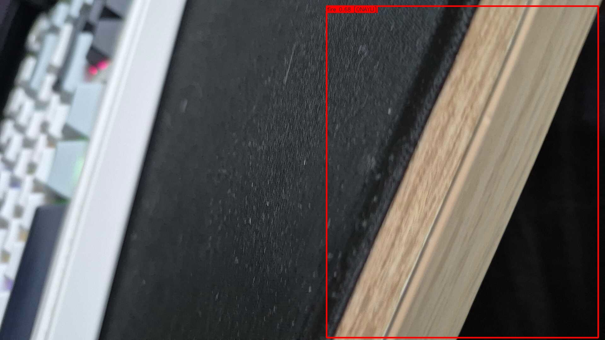
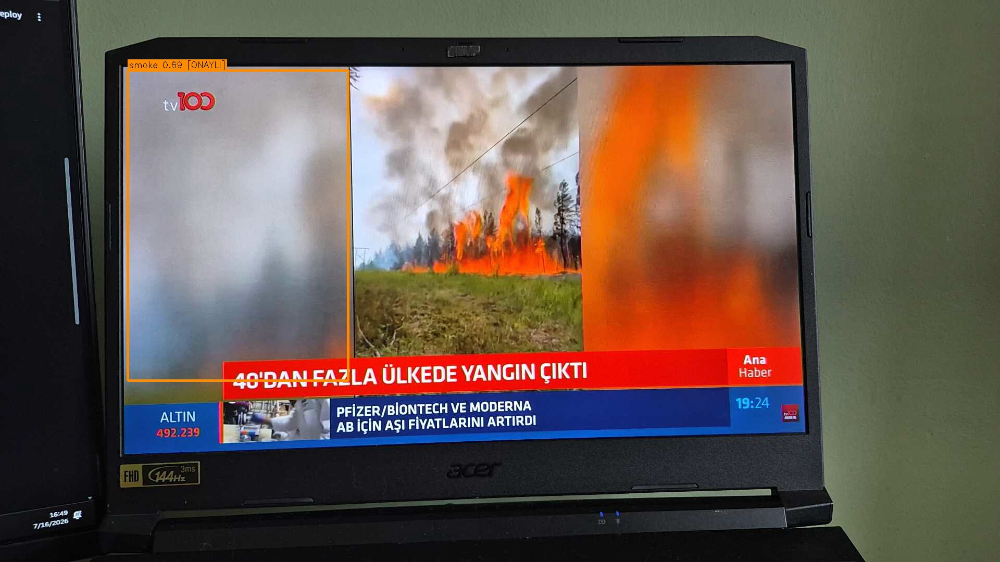

# YOLO Plate · Helmet-Vest · Fire-Smoke · Medical-PPE Detection

[](https://www.python.org/)
[](https://docs.ultralytics.com/)
[](https://streamlit.io/)
[](LICENSE)

Staj kapsamında geliştirilmiş, **4 bağımsız YOLO tabanlı görüntü işleme modülünü tek bir Streamlit arayüzünde birleştiren** gerçek zamanlı tespit ve izleme platformu: **plaka okuma (OCR)**, **baret & yelek denetimi**, **yangın & duman izleme** ve **tıbbi PPE (KKD) uyum denetimi**.

Her modül fotoğraf, video ve canlı telefon kamerası (IP Webcam) ile çalışır; tespitler CSV'ye yazılır, kanıt fotoğraflarıyla arşivlenir. Arayüzdeki **"Metrikleri Hesapla"** butonu her modelin doğruluk metriklerini test setinde canlı ölçer — sabit, ezber değer yok.


## Çalışırken — gerçek ekran görüntüleri

Aşağıdaki görüntülerin tamamı sistem çalışırken alındı: önce uygulamanın gerçek arayüzü, ardından her modelin gerçek bir örnek üzerindeki anotasyonlu çıktısı.

### Plaka tespiti + OCR

| Arayüz (örnek galeri) | Model çıktısı (`araba1.jpg` → **34 N 5953**, %96,2) |
|---|---|
|  |  |

Üretim hattı tek karede 3 ölçekte tarama yapar, kutuları tekilleştirir, eğikliği düzeltir, mavi bant/turuncu sticker temizler ve 5 görüntü varyantında OCR oylaması yapar (tam log çıktısı yukarıdaki gibi konsolda görülür).

### Baret & Yelek

| Arayüz (ihlal kayıtlarıyla) | Model çıktısı (kişi + `no-safety-vest` tespiti) |
|---|---|
|  |  |

### Yangın & Duman

| Arayüz (sınıf bazlı eşiklerle) | Model çıktısı (`fire` 0,72 + `smoke` 0,41) |
|---|---|
|  |  |

Video tarafında bu tespitler tek başına alarm üretmez — YOLO track + N-of-M zamansal onaydan (fire 4/8, smoke 5/10) geçen olaylar kanıt fotoğrafıyla kaydedilir:

| Yangın — onaylı olay kanıtı | Duman — onaylı olay kanıtı |
|---|---|
|  |  |

### Tıbbi PPE

| Arayüz (örnek galeri) | Model çıktısı (`kişi`, `bone`, `maske`, `önlük` — ihlal yok) |
|---|---|
|  |  |

## Neden iyi bir proje?

- **Gerçek ölçüm kültürü:** Eşikler "göz kararı" değil, F1-Confidence eğrilerinin zirvesinden kalibre edildi. Plaka ve tıbbi PPE metrikleri düz `model.val()` ile değil, **üretimdeki gerçek pipeline** çalıştırılarak ölçüldü.
- **Zamansal akıl:** Video tarafında YOLO track + N-of-M onayı sayesinde tek karelik parlamalar alarm üretmiyor; kararlar biriken kanıtla veriliyor.
- **Ölçülerek reddedilen fikirler:** P2 tespit başlığı, 3×3 dilimleme, tam kareyi büyütme gibi yollar denendi, test setinde fayda göstermeyince geri alındı — raporları `docs/` altında.
- **14.375 görüntülük eğitim seti** birleştirildi; zayıf sınıflara 10-15 kat ek veri sağlandı, test seti sızıntısı olmadan.

## Modüller ve ölçülmüş sonuçlar

| Modül | Klasör | Ne yapar | Test sonucu |
|---|---|---|---|
| Plaka Tespiti + OCR | `PlateDetection/` | Çok geçişli YOLO tespiti, CLAHE + EasyOCR okuma, Türk plaka doğrulaması, videoda iz takibi + karakter oylaması | P %91,7 · R %85,7 · **mAP50 %86,1** (gerçek hat, 391 görüntü) |
| Baret & Yelek | `VestAndBaret/` | hardhat / no-hardhat / safety-vest / no-safety-vest / person — iş güvenliği ihlal tespiti | P %92,6 · R %91,0 · **mAP50 %94,6** (eğitim-doğrulama) |
| Yangın & Duman | `FireAndSmoke/` | Track + N-of-M zamansal onay (fire 4/8, smoke 5/10), kanıt fotoğrafı + CSV | P %72,8 · R %53,0 · **mAP50 %61,1** (351 görüntü) |
| Tıbbi PPE | `MedicalPPE/` | 14 sınıf KKD denetimi, TTA + 2×2 dilimli tespit, kişi-ekipman eşleştirme | P %76,3 · R %80,3 · **mAP50 %80,0** (535 görüntü) |

## Mimari — 4 bağımsız modül, tek arayüz

Hiçbir modül diğerini import etmez; her biri komut satırından tek başına da çalışır. Video/canlı izlemede ortak katmanlar: YOLO track (kalıcı iz kimliği) → sınıf bazlı güven eşiği (F1 zirvesinden kalibre) → N-of-M zamansal filtre → onay anında kanıt kaydı (fotoğraf + CSV, alarm yok). Fotoğraf modunda TTA her zaman açıktır.

## Hızlı başlangıç

```bash
# Windows — tek tık:
scripts\run-windows.bat

# Linux / macOS:
bash scripts/run.sh
```

Detaylı kurulum (venv, GPU/CPU bağımlılıkları, eksik model dosyalarının tamamlanması): **[docs/kurulum.md](docs/kurulum.md)**

> Not: Büyük model dosyaları (`.pt`) depoda değildir (bkz. `.gitignore`). Hangi dosyayı nereye koyacağınız `docs/kurulum.md` §4'te yazıyor.

## Proje yapısı

```
app.py                  → 4 sekmeli Streamlit arayüzü (tek giriş noktası)
requirements.txt        → tek venv ile kurulan tüm bağımlılıklar
PlateDetection/         → plaka tespiti + OCR (fotoğraf ve video hattı)
VestAndBaret/           → baret & yelek modeli ve ihlal logu
FireAndSmoke/           → yangın/duman izleyici, eğitim ve değerlendirme scriptleri
MedicalPPE/             → tıbbi PPE izleyici, veri birleştirme, eğitim scriptleri
scripts/                → Windows (.bat) ve Linux/macOS (.sh) başlatıcılar
docs/
  kurulum.md            → başka bilgisayarda çalıştırma rehberi
  proje-raporu.md       → tüm projenin teknik anlatısı
  plaka-video-mantigi.md→ video plaka takibinin adım adım açıklaması
  plaka-pipeline.md     → plaka fotoğraf hattı detayları
  screenshots/          → arayüz şemaları + gerçek sistem çıktıları
```

Her modülün kendi teknik raporu kendi klasöründedir (`TEKNIK_RAPOR.md` / `README.md`).

## Ortak mimari (video/canlı izleme)

1. **YOLO track** — nesnelere kareler arası kalıcı kimlik.
2. **Sınıf bazlı güven eşiği** — her sınıfın eşiği kendi F1 zirvesinden.
3. **N-of-M zamansal filtre** — iz, son M karenin N'inde görüldüyse onaylanır.
4. **Kanıt kaydı** — onay anında anotasyonlu fotoğraf + CSV satırı (alarm/bildirim yok — sistem izleme ve kayıt için tasarlandı).

Fotoğraf modunda TTA (test zamanında veri artırma) her zaman açıktır; tıbbi PPE'de buna %20 örtüşmeli 2×2 dilimli tespit eklenir.

## Teknolojiler

Python 3.13 · Ultralytics YOLO11 · PyTorch (CUDA) · EasyOCR · OpenCV · Streamlit · pandas · NumPy · Roboflow

## Veri setleri ve teşekkür

- Plaka: `guler-kandeger/plate-detection-vh2rk` (Roboflow, CC BY 4.0)
- Yangın/duman: iki Roboflow kaynağının sınıf-eşlemeli birleşimi (detay: `FireAndSmoke/prepare_dataset.py`)
- Tıbbi PPE: 5 Roboflow kaynağının birleşimi, 14 ortak sınıf (detay: `MedicalPPE/prepare_dataset.py`)

Veri seti sahiplerine ve açık kaynak topluluğuna teşekkürler.

## Lisans

MIT — bkz. [LICENSE](LICENSE).
